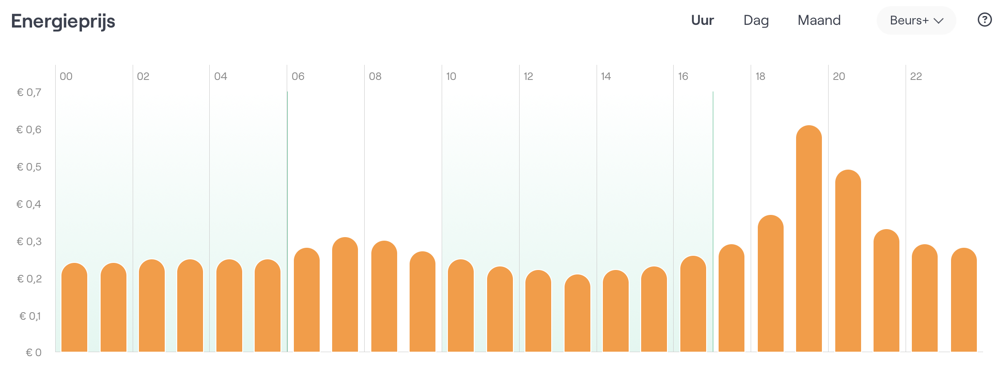
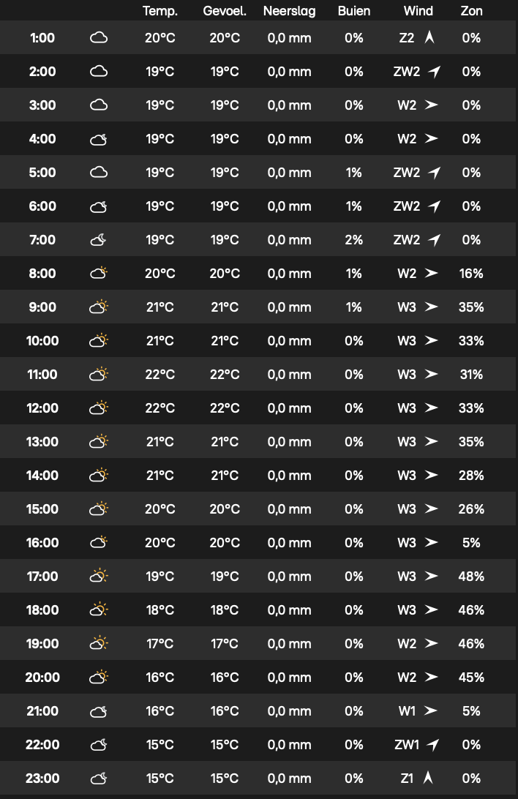

# Fennec

[FoxESS plug-in home battery](https://www.nextenergy.nl/artikelen/voor-batterij-fanaten) steering based
on [NextEnergy real-time prices](https://www.nextenergy.nl/actuele-energieprijzen).

[](https://github.com/eigenein/fennec/actions/workflows/check.yaml)
[](https://github.com/eigenein/fennec/commits/main/)

I built this because I wasn't happy with the out-of-the-box integration of FoxESS with NextEnergy. At the time of writing, NextEnergy offered two battery control strategies:

- **Self-consumption:** charges with excess PV power and discharges when PV power is insufficient. Unfortunately, this doesn't take advantage of dynamic prices at all.
- **Price steering:** charges when energy is cheap and discharges when it's expensive. However, it's not what I expected – it's just a «typical» daily schedule that doesn't adapt to different price patterns on different days, nor does it take advantage of excess PV power.

Fennec, on the other hand, uses extensive information to build an optimal charging schedule:

- Current battery charge
- Battery charging and discharging efficiency
- Energy price chart for upcoming hours
- Solar power forecast for upcoming hours
- Household standby power consumption
- Energy feed-in tariff («inkoopvergoeding»)

Fennec is designed to run as a cron job, continuously refining and updating the schedule.

## Caveats

- [FoxESS Cloud](https://www.foxesscloud.com/public/i18n/en/OpenApiDocument.html#set20the20time20segment20information0a3ca20id3dset20the20time20segment20information7193e203ca3e) only allows up to 8 schedule slots. It might happen that Fennec would build a schedule with more slots. In that case, only the upcoming 8 slots will be pushed. So, make sure to run Fennec periodically.

## Example Kubernetes job

```yaml
apiVersion: "batch/v1"
kind: "CronJob"
metadata:
  name: "fennec"
spec:
  timeZone: "Europe/Amsterdam"
  schedule: "5 * * * *"
  startingDeadlineSeconds: 600
  concurrencyPolicy: "Replace"
  successfulJobsHistoryLimit: 1
  jobTemplate:
    spec:
      backoffLimit: 3
      ttlSecondsAfterFinished: 86400
      template:
        spec:
          restartPolicy: "OnFailure"
          containers:
            - name: "fennec-job"
              image: "ghcr.io/eigenein/fennec:0.1.5"
              env:
              - name: "TZ"
                value: "Europe/Amsterdam"
              - name: "WEERLIVE_API_KEY"
                value: "..."
              - name: "FOX_ESS_SERIAL_NUMBER"
                value: "..."
              - name: "FOX_ESS_API_KEY"
                value: "..."
              - name: "LOGFIRE_TOKEN"
                value: "..."
              command:
                - "/fennec"
                - "hunt"
```

## Example

Given the current residual energy of 3.87 out of 8.44 kWh by 01:00, for the following price chart:



and the following weather forecast:



Fennec generates the following schedule:

```text
Time slot start_time=01:00, end_time=02:00, working_mode=Charging
Time slot start_time=02:00, end_time=06:00, working_mode=Balancing
Time slot start_time=06:00, end_time=10:00, working_mode=Discharging
Time slot start_time=10:00, end_time=11:00, working_mode=Balancing
Time slot start_time=11:00, end_time=16:00, working_mode=Charging
Time slot start_time=16:00, end_time=23:59, working_mode=Discharging
```

## Energy costs cheatsheet


